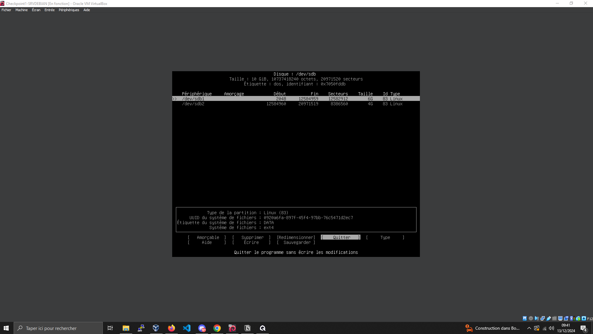
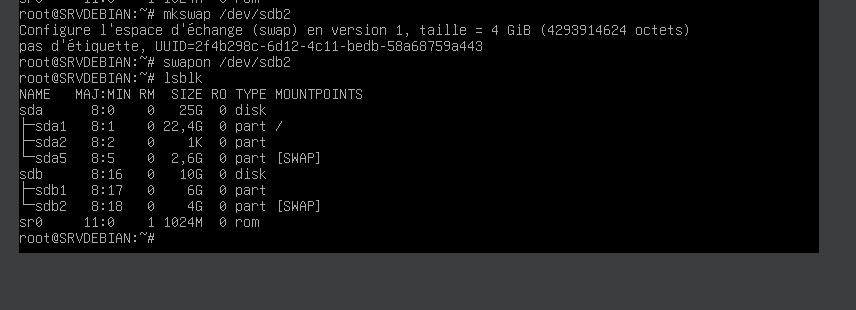
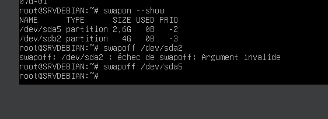
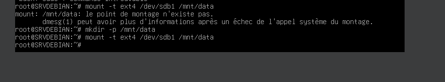
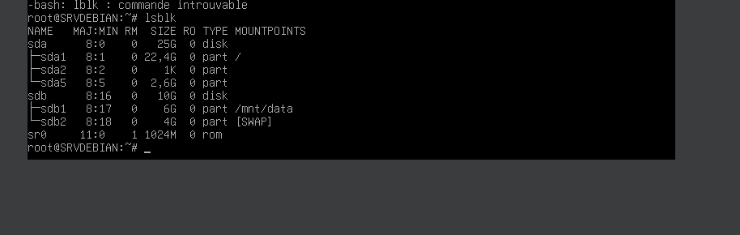

# Exo 1 Checkpoint1

## Etape 1 : Créer des partitions 🖥️
J'ai donc lancé `cfdisk /dev/sdb` et créé deux partitions primaires.

```bash
cfdisk /dev/sdb
```

## Etape 2 : Formater les partitions 💾
Une fois les partitions créées, j'ai formaté la première partition avec la commande suivante :

```bash
sudo mkfs.ext4 -L DATA /dev/sdb1
```
## Etape 3 : Partitionner et activer SWAP 🔄
Ensuite, j'ai utilisé `fdisk` pour partitionner la deuxième partition en tant que swap :

```bash
fdisk /dev/sdb2
```
*J'ai oublier de screenshot ici mais en gros j'ai fais : n (ajouter une nouvelle partition) t (type de partition = s pour swap) et après j'ai tout mis en défauts*

J'ai ensuite activé la partition swap avec la commande suivante :

```bash
sudo swapon /dev/sdb2
```
(

Puis j'ai désactivé le swap de la partition de base avec la commande suivante :

```bash
sudo swapoff /dev/sda5
```

## Etape 4 : Monter la partition 📂
Pour monter la partition /dev/sdb1 j'ai créé d'abord un répertoire :

```bash
mkdir -p /mnt/data
```

Ensuite, j'ai monté la partition avec la cmd suivante :

```bash
sudo mount -t ext4 /dev/sdb1 /mnt/data
```

## Etape 5 : Configurer le SWAP pour l'activation auto au démarrage ⚙️
Ensuite, pour que le swap soit activé automatiquement au démarrage, j'ai modifié le fichier `/etc/fstab`.
Pour trouver l'UUID de la partition swap, j'ai utiliser la cmd `blkid`
Ensuite une fois que j'ai récupérer l'UUID j'ai fais `nano /etc/fstab` pour l'éditer comme j'ai dis en haut
et j'ai ajouter la ligne suivante pour activer automatiquement le swap au démarrage
```bash
UUID=0920a6fa-897f-45f4-97bb-76c5471d2ec7 none swap sw 0 0
```

## Etape 6 : J'applique les changements 🔄
Appliquer les changements sans redémarrage j'ai fais
```bash
sudo mount -a
```
## Etape 7 : Verifier les l'état des partitions 🛠️
Et pour finir pour m'assurer que tout sois fonctionnel et qu'il n'y a pas d'erreur j'ai fais
```bash
lsblk
```


*Dans le dossier img les screenshot ne sont pas dans l'ordre !*
